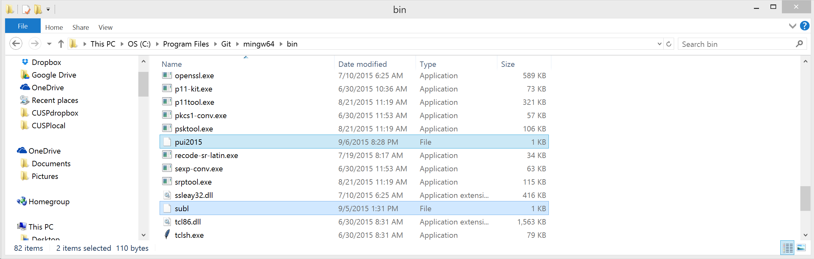
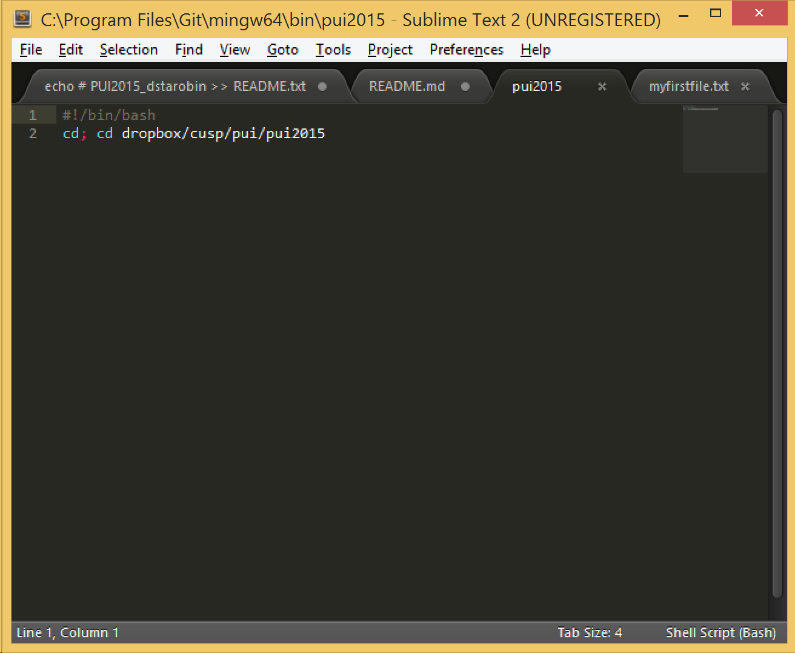
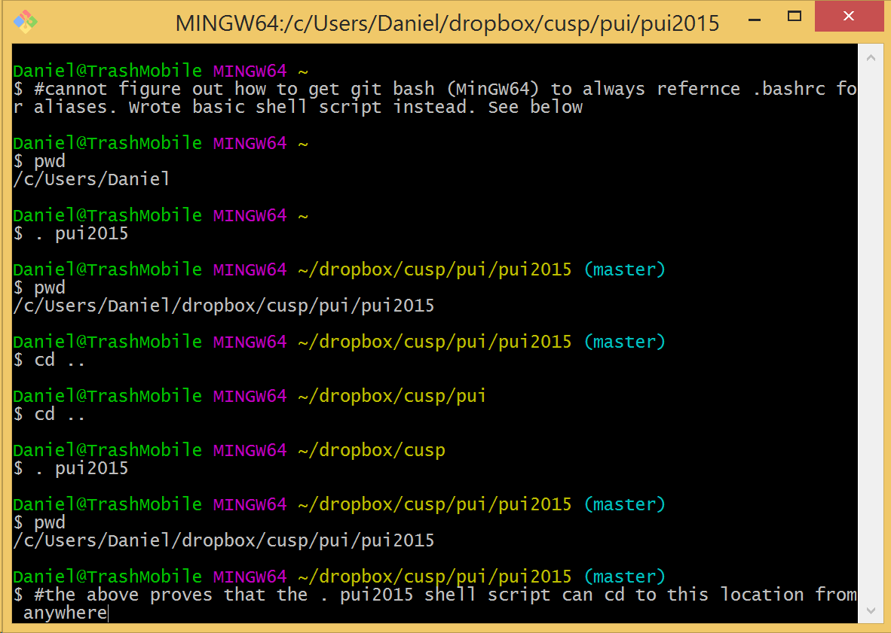

# PUI2015_dstarobin

There are several idiosyncracies unique to a Git bash Windows
implementation. The most notable are that 1) emacs will not 
run on a Windows machine and I'm not comfortable with VIM,
and 2), I could find no documemtation about enabling an alias
to always initialte in Git bash for Windows via bashrc 
(i.e. source bashrc) when instantiating the shell. I tried
creating a .bashrc in at least a dozen directories based on
hints I found online, but I couldn't find a way to make an 
alias always available without having to enter "source .bashrc"
at the start of every session. I'd appreciate some feedback/
advice if there's a legit way to do it on a Windows machine.

I abandoned the alias idea and instead went with a simple 
bash shell script. I've hightlighted two shell scripts in the
image below. One is the default text editor script (subl), which
will launch Sublime; the other is the "alias" script.

Below are two screenshots; the first is of the contents of 
the "alias" script, while the second is the script in action.

